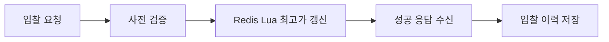
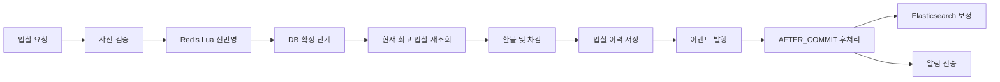

# BidServiceImpl Hardening

> Redis 선반영 입찰 로직의 정합성 강화 

초기 `BidServiceImpl` 대비 현재 `BidServiceImpl` 의 구조 변화 정리.

## 목차

- [문서 범위](#문서-범위)
- [한눈에 보기](#한눈에-보기)
- [기존 구조](#기존-구조)
- [문제와 수정](#문제와-수정)
- [현재 구조](#현재-구조)
- [검증 포인트](#검증-포인트)
- [관련 코드](#관련-코드)
- [핵심 정리](#핵심-정리)

## 문서 범위

- 대상: `BidServiceImpl`
- 비교 기준: 초기 구현 / 현재 구현
- 주제: 동시성 제어, 금전 정합성, 실패 복구, 검색 반영, 알림 처리
- 핵심 관점: Redis의 빠른 선반영 구조 위에 DB 확정 구조를 덧씌운 하드닝 과정

## 한눈에 보기

| 구분 | 초기 구현 | 현재 구현 |
|------|-----------|-----------|
| 입찰 성공 기준 | Redis Lua 성공 응답 중심 | DB 확정 단계 통과 기준 |
| 입찰 흐름 | 사전 검증 → Redis 갱신 → 입찰 이력 저장 | 사전 검증 → Redis 선반영 → DB 확정 → 이벤트 발행 → AFTER_COMMIT 후처리 |
| 정합성 기준 | Redis 반환값 중심 | DB 커밋 상태 중심 |
| 롤백 방식 | 정교한 상태 버전 관리 부재 | `state_version` 기반 조건부 롤백 |
| 환불 기준 | Redis 이전 상태 의존 가능성 | DB 최고 입찰 재조회 기준 |
| Pay 처리 | 초기 구현 기준 부재 | 사전 잔액 검증, 환불, 차감 포함 |
| 검색 반영 | 트랜잭션 내부 처리 가능성 | AFTER_COMMIT 이후 DB 기준 보정 |
| 알림 처리 | 서비스 내부 직접 처리 가능성 | AFTER_COMMIT 이벤트 분리 |

## 기존 구조

### 구조 개요

1. 입찰 요청 수신
2. 입찰 가능 여부 사전 검증
3. Redis Lua 기반 최고가 갱신
4. 성공 응답 기준 입찰 이력 저장

### 구조적 장점

- 빠른 경쟁 처리
- DB 락 경합 감소
- 단순한 제어 흐름
- 초기 구현 비용 절감

### 구조적 한계

- Redis 성공과 비즈니스 성공의 경계 불명확
- Redis 선반영 이후 DB 실패 시 불일치 위험
- 금전 처리 기준의 흔들림 가능성
- 검색 인덱스와 알림의 반영 시점 불명확
- 실패 복구 전략의 취약성

### 초기 흐름

## 문제와 수정

### 1. 입찰 성공 기준의 불명확성

#### 기존 구조

- Redis Lua `SUCCESS` 반환 직후 성공 흐름 진입
- Redis 결과 중심의 후속 처리

#### 문제

- Redis 선반영 이후 DB 저장 실패 가능성
- Redis 상태와 DB 상태의 불일치 가능성
- 성공 판정 지점의 모호성

#### 수정

- Redis 단계와 DB 확정 단계의 분리
- `READ_COMMITTED` 적용
- `findByIdForUpdate()` 기반 판매글 재조회
- DB 최고 입찰 재검증 단계 추가

#### 해결

- Redis의 역할: 경쟁 조정
- DB의 역할: 최종 진실
- 성공 판정 기준의 명확화
- 선반영과 최종 확정 사이의 정합성 간극 축소

### 2. 실패 보상 방식의 취약성

#### 기존 구조

- 실패 보상 전략의 단순성
- 상태 버전 정보 부재

#### 문제

- 단순 값 복원 방식의 최신 상태 덮어쓰기 위험
- 동시 입찰 환경에서의 잘못된 롤백 가능성
- 이전 상태 부재 상황에서의 비정상 값 복원 위험

#### 수정

- Redis 키 체계 정비
- `highest_price`, `highest_bidder_id`, `state_version` 관리
- `bid.lua` 에 상태 버전 증가 로직 추가
- `bid_rollback.lua` 에 조건부 롤백 로직 추가
- 이전 상태 부재 표현의 `__nil__` 전환
- 첫 입찰 롤백 시 키 삭제 방식 적용

#### 해결

- 내가 반영한 상태에 한정된 롤백
- 최신 상태 덮어쓰기 위험 제거
- 최고가 0원 복원 같은 비정상 상태 제거

### 3. 금전 정합성의 취약성

#### 기존 구조

- Redis 반환값 기반 이전 최고 입찰 판단 가능성
- 금전 처리 기준과 DB 커밋 상태 기준의 분리 가능성

#### 문제

- 환불 대상 오판 가능성
- 환불 금액 오차 가능성
- Redis와 DB 불일치 시 금전 정합성 훼손 가능성

#### 수정

- DB 확정 단계에서 최고 입찰 재조회
- `findTopByTransactionFeedOrderByBidAmountDescBidTimeDesc(...)` 기반 최고 입찰 조회
- DB 기준 현재 최고 입찰 환불
- 새 입찰자 Pay 차감
- 사전 잔액 검증 추가

#### 해결

- 금전 처리 기준의 DB 일원화
- 환불·차감의 커밋 상태 정렬
- 금전 정합성 강화

### 4. 외부 부작용 처리 시점의 불안정성

#### 기존 구조

- 검색 인덱스 반영과 알림 전송의 서비스 내부 처리 가능성
- 입찰 성공 흐름 내부의 직접 후처리

#### 문제

- DB 롤백 이후에도 ES 반영 또는 알림 발송 가능성
- DB, 검색, 알림 간 상태 분리 위험
- stale 값의 외부 시스템 확산 가능성

#### 수정

- `BidSucceededEvent` 기반 후처리 분리
- `@TransactionalEventListener(phase = AFTER_COMMIT)` 적용
- Elasticsearch 갱신 시 이벤트 값 직접 사용 배제
- DB 최고 입찰 재조회 기반 문서 보정

#### 해결

- 커밋 완료 이후 후처리만 허용
- 외부 부작용과 트랜잭션 내부 처리의 경계 정리
- 검색 문서와 알림의 커밋 상태 정렬

### 5. 설계 의도 고정 장치의 부족

#### 기존 구조

- 동작 구현 중심
- 장애 시나리오 회귀 방지 장치 부족

#### 문제

- 리팩터링 이후 동일 문제 재발 가능성
- 설계 의도 소실 가능성

#### 수정

- 회귀 테스트 추가
- Redis 키 구성 검증
- 버전 기반 롤백 호출 검증
- DB 최고 입찰 기준 환불 검증
- `findByIdForUpdate()` 호출 검증
- AFTER_COMMIT 이벤트 발행 및 후처리 검증

#### 해결

- 설계 결정의 테스트 고정
- 동시성·정합성 회귀 리스크 감소

## 현재 구조

### 현재 흐름

### 현재 구조의 핵심 원칙

- Redis 선반영 구조
- DB 확정 중심 구조
- 조건부 롤백 구조
- 금전 처리의 DB 기준 정렬
- AFTER_COMMIT 기반 외부 부작용 분리

### 현재 구조의 실무적 의미

- 속도 최적화와 정합성 확보의 균형
- 캐시성 상태와 영속 상태의 역할 분리
- 동시성 제어와 금전 처리 책임의 분리
- 커밋 이전 처리와 커밋 이후 처리의 경계 명확화

## 검증 포인트

- Redis 키의 동일 hash tag 사용 여부
- DB 확정 실패 시 버전 기반 롤백 수행 여부
- 환불 기준의 DB 최고 입찰 일치 여부
- DB 최고가가 더 높을 때 입찰 실패 처리 여부
- 판매글 비관적 락 조회 여부
- AFTER_COMMIT 이벤트 발행 여부
- AFTER_COMMIT 이후 Elasticsearch 최고가 보정 여부

## 관련 코드

### 핵심 서비스

- [BidServiceImpl](src/main/java/eureca/capstone/project/orchestrator/transaction_feed/service/impl/BidServiceImpl.java)
- [TransactionFeedRepository](src/main/java/eureca/capstone/project/orchestrator/transaction_feed/repository/TransactionFeedRepository.java)

### Redis Lua

- [bid.lua](src/main/resources/scripts/bid.lua)
- [bid_rollback.lua](src/main/resources/scripts/bid_rollback.lua)

### 이벤트 후처리

- [BidSucceededEvent](src/main/java/eureca/capstone/project/orchestrator/transaction_feed/event/BidSucceededEvent.java)
- [BidSucceededEventHandler](src/main/java/eureca/capstone/project/orchestrator/transaction_feed/event/BidSucceededEventHandler.java)

### 회귀 테스트

- [BidServiceImplRegressionTest](src/test/java/eureca/capstone/project/orchestrator/transaction_feed/service/impl/BidServiceImplRegressionTest.java)
- [BidSucceededEventHandlerTest](src/test/java/eureca/capstone/project/orchestrator/transaction_feed/event/BidSucceededEventHandlerTest.java)

## 핵심 정리

- 초기 구조의 강점: 단순성, 속도
- 현재 구조의 강점: 정합성 경계의 명확화
- 이번 하드닝의 본질: 기능 추가가 아닌 구조 재정의

최종 정리

- Redis 성공과 비즈니스 성공의 분리
- 금전 처리와 캐시 상태의 분리
- 트랜잭션 내부 처리와 외부 부작용의 분리
